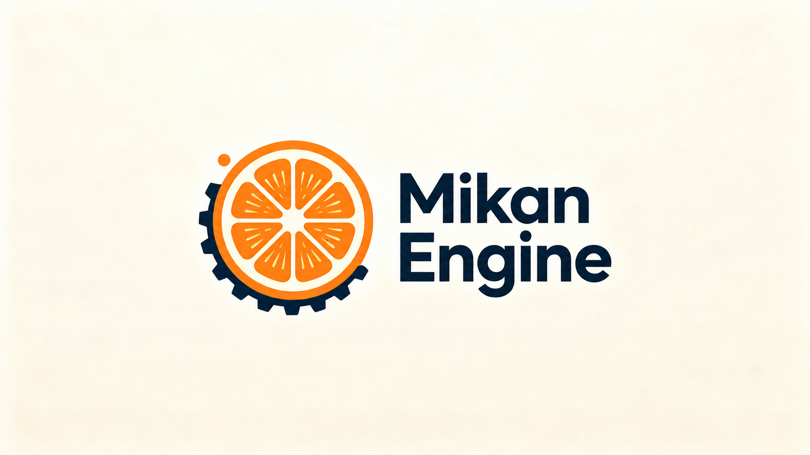

# MikanEngine OHOS

<p align="center">
  
</p>

<p align="center">
  基于 C++17、SDL3、Vulkan / OpenGL ES 和 Jolt Physics 的 HarmonyOS 原生 3D 运行工程。
</p>

<p align="center">
  
  
  
  
  
</p>

<p align="center">
  <a href="#技术栈">技术栈</a> · <a href="#架构">架构</a> ·
  <a href="#功能">功能</a> · <a href="#构建">构建</a> ·
  <a href="#场景与资源">场景与资源</a> · <a href="#运行与验证">运行与验证</a> ·
  <a href="#许可证与第三方组件">许可证</a>
</p>

本工程承接 [MikanEngine](https://github.com/ForgottenCyanKnight/MikanEngine) 的场景与移动端运行探索，采用独立的 OHOS 应用入口、构建链和渲染实现。桌面端负责场景创作，本工程读取导出的场景数据并打包运行。仓库包含经过 OHOS 适配的 SDL3 源码和应用代码，克隆后无需另行获取桌面引擎源码。

## 技术栈

| 类别 | 技术与用途 |
|---|---|
| 原生语言 | C++17；SDL 底层使用 C |
| 应用宿主 | ArkTS、Stage 模型、EntryAbility |
| 窗口与输入 | SDL3 OHOS 适配、触控与应用生命周期事件 |
| 图形 | Vulkan、OpenGL ES 3、EGL；GLSL / SPIR-V |
| 渲染组织 | RHI 后端选择与统一渲染器接口 |
| 物理 | Jolt Physics；角色移动与场景碰撞 |
| 场景与模型 | Mikan SceneSerializer v1 JSON、glTF / GLB 模型加载 |
| 音频与平台接口 | OHAudio、OHOS rawfile、HiLog、传感器链接接口 |
| 构建 | DevEco Studio、Hvigor、OHPM、CMake、BiSheng |
| 目标 | HarmonyOS 6.0.0 / API 20；arm64-v8a、x86_64 |

## 架构

```text
ArkTS / EntryAbility          应用宿主与平台生命周期
└── SDL3 OHOS                 原生窗口、事件与输入桥接
    └── libentry.so           C++ 应用入口与主循环
        ├── scene            场景 JSON 解析与运行时定义
        ├── physics          Jolt 世界、碰撞与角色状态
        ├── touch_controller 触控、摇杆和动作输入
        ├── audio            OHAudio 播放与混音
        └── rhi::IRenderer   渲染器接口
            ├── Vulkan       Vulkan 设备、交换链与绘制
            └── GLES         EGL / OpenGL ES 绘制
```

应用层管理场景、物理和渲染器生命周期。各渲染后端持有自己的图形资源，通过 RHI 接收场景与输入。切换到后台、恢复前台和窗口尺寸变化由应用事件与渲染器回调协同处理。

### 项目结构

```text
.
├── CMakeLists.txt            SDL3 原生构建入口
├── cmake/                   SDL 构建模块与模板
├── include/、src/           SDL3 头文件与源码
├── build-scripts/           SDL 构建辅助脚本
└── ohos-project/            用 DevEco Studio 打开的应用工程
    ├── AppScope/            应用级信息与资源
    ├── hvigor/              Hvigor 配置
    ├── build-profile.json5  SDK、产品与模块配置
    ├── entry/src/main/
    │   ├── ets/             ArkTS 宿主
    │   ├── cpp/
    │   │   ├── application/ 应用、场景、物理、音频与渲染
    │   │   └── third_party/ Jolt Physics 等依赖
    │   └── resources/       UI 与 rawfile 运行资源
    └── tools/               字体生成等资源工具
```

## 功能

### 渲染与资源

- Vulkan / GLES 双后端，包含模型、材质、天空盒和图形资源管理代码。
- 场景 shader 包含 IBL、阴影、模型、Bloom、后处理及 UI 绘制路径。
- glTF / GLB 模型、纹理和动画相关数据加载。
- 字体、图标、触控覆盖层以及菜单与设置界面。

两个后端的功能覆盖和交互行为仍有差异，具体效果以选定后端和设备为准。桌面引擎的编辑器、插件热重载和完整渲染管线仍在主仓库维护。

### 场景、交互与音频

- 读取 Mikan 导出的 SceneSerializer v1 场景，并使用随包资源运行。
- Jolt 场景碰撞与角色移动；触控摇杆、视角输入和动作按钮。
- 主菜单、游戏设置、重试与背包界面的状态接口。
- 从 OHOS rawfile 加载音频，通过 OHAudio 播放、循环与混音。

## 构建

### 环境要求

- 推荐 Windows 与 DevEco Studio，安装 HarmonyOS 6.0.0 / API 20 对应 SDK 和原生工具链。
- 使用 DevEco 配套的 Node.js、JBR、OHPM 和 Hvigor，保持工具版本与工程匹配。
- Git；Python 和 shader 编译器仅在重新生成 shader / 工具资源时需要。

应用原生模块使用 C++17，构建配置同时包含 `arm64-v8a` 和 `x86_64`。SDL3 与 Jolt 源码已在仓库中；平台系统库由 SDK 提供。

### 使用 DevEco Studio

1. 克隆仓库：

   ```powershell
   git clone https://github.com/ForgottenCyanKnight/MikanEngine-ohos.git
   cd MikanEngine-ohos
   ```

2. 在 DevEco Studio 中打开 **`ohos-project/`**，完成 SDK 设置与依赖同步。
3. 选择 `default` 产品与 `entry` 模块，构建 HAP。
4. 如需安装到设备，在 IDE 中配置自己的签名，再连接设备运行。

上传版本的 `build-profile.json5` 将 `signingConfigs` 留空，未绑定签名。无签名构建可用于检查编译与打包；设备安装需要有效签名。IDE 自动生成的证书路径和密码应保留在本机，提交前检查配置差异。

### Windows 命令行

在仓库根目录执行，将安装路径换成自己的 DevEco Studio 路径：

```powershell
$env:DEVECO_INSTALL_DIR = 'C:\Program Files\Huawei\DevEco Studio'
$env:Path = "$env:DEVECO_INSTALL_DIR\tools\ohpm\bin;$env:Path"
cd ohos-project

ohpm install
.\hvigorw.bat --mode module -p product=default -p module=entry@default assembleHap --no-daemon
```

仓库的 `hvigorw.bat` 会从 `DEVECO_INSTALL_DIR` 查找 DevEco 自带的 Node、Hvigor、JBR 和 SDK。当前没有随仓库提供独立的 `hvigor-wrapper.js`，因此命令行也需要安装 DevEco Studio。

构建产物位于 `ohos-project/entry/build/` 下，HAP 通常在 `default/outputs/default/`；具体文件名和签名状态以构建输出为准。`oh_modules/`、`.hvigor/`、`.cxx/`、`build/` 和 `local.properties` 属于本地产物，不提交到 Git。

### Shader 更新

Vulkan shader 的生成头文件已提交，普通应用构建直接使用它们。修改 `application/shaders/` 内对应 GLSL 后，可重新生成：

```powershell
# 在 ohos-project/ 目录执行
$env:GLSLANG = "$env:DEVECO_INSTALL_DIR\sdk\default\openharmony\toolchains\glslang_validator.exe"
python .\entry\src\main\cpp\application\build_scene_shaders.py
```

脚本更新 `scene_shaders_spv_vulkan.h`，请同时提交修改的 shader 源码和对应生成头文件。

## 场景与资源

运行资源位于 `ohos-project/entry/src/main/resources/rawfile/`。原生 CMake 在配置阶段将场景复制到 `rawfile/scenes/main.json`，读取顺序为：

1. 显式指定的 CMake 参数 `MIKAN_SCENE_FILE`。
2. 当前源码中配置的作者工作站场景路径（仅在该文件存在时使用）。
3. 仓库自带的 `application/scene/default_main.json`。

其他机器默认可以使用仓库中的场景。若需要固定另一个导出场景，可在模块的 `externalNativeOptions.arguments` 中加入 `-DMIKAN_SCENE_FILE=<场景文件路径>`。场景引用的模型、纹理和音频也需要按加载器约定打包到 rawfile；只复制 JSON 不会自动同步外部资产。

当前配置仍包含作者工作站的可选场景探测路径，在该机器上构建可能重新生成打包场景。需要可重复的场景输入时，应显式指定 `MIKAN_SCENE_FILE`。

## 运行与验证

默认按架构选择后端：`x86_64` 使用 GLES，其他架构优先 Vulkan。可通过进程环境变量 `MIKAN_RHI=vulkan` 或 `MIKAN_RHI=gles` 覆盖选择；这需要启动应用的环境实际将变量传入原生进程。首选后端初始化失败时，应用会尝试另一个后端。

可在 DevEco 的日志窗口查看 `SDL3_RHI` 与 `SDL3_LIFE`，确认实际后端及前后台恢复流程。建议分别检查：

- 首次启动、窗口尺寸变化、切换后台与恢复。
- 场景和资源加载、触控移动、跳跃与碰撞。
- 菜单、设置和音频行为。
- arm64 真机与 x86_64 模拟器各自的渲染表现。

编译成功、模拟器运行和真机表现应分别验证。本说明依据当前源码与配置整理，未声明全部后端和设备完成一致性测试。

## 许可证与第三方组件

本仓库基于 SDL3 源码树，SDL 的许可证见 [LICENSE.txt](LICENSE.txt)。Jolt Physics、模型加载与图像处理等第三方代码按各自的许可证及源码声明使用；示例模型、字体和音频也应分别核对来源与使用条件。

主仓库的许可证说明不能直接替代本仓库中各组件和资源的授权声明。发布应用时请保留适用的版权与许可证信息。
